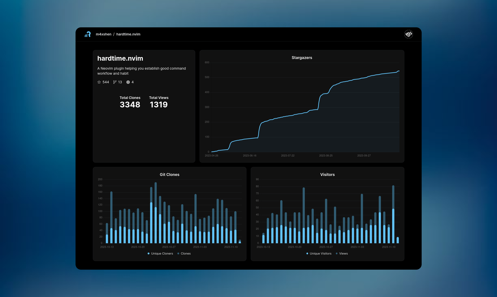

  
  <b>
    Repohistory is a GitHub repository traffic history tracker that keeps records beyond the standard 14 days, offering an easy and detailed long-term view.
  </b>

  

## Motivation

GitHub's 14-day limit on repository data often leaves developers without vital long-term insights. Repohistory addresses this by offering an easy-to-setup, beautifully designed interface for extended repository tracking. This gives developers a powerful tool to analyze trends and progress over time, not just a brief snapshot.

## Features

- 📊 **Data Tracking**: Start tracking clones and views data from your first login.
- 📈 **All-Time Stars History**: Visualize the growth of your repo with an all-time stars history graph.
- 🖥️ **Dashboard Overview**: Easily access a dashboard view for an overview of all your projects.
